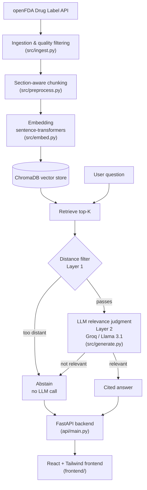

# MedAssist — RAG-Powered Clinical Knowledge Assistant

A retrieval-augmented generation (RAG) system that answers natural-language drug questions using real FDA drug label data — with mandatory source citations and a measured, evaluated defense against hallucination.

> **Educational demo only — not medical advice.** Built on public FDA label data. Not a substitute for consulting a healthcare professional.

---

## What it does

Ask a question like *"What are the contraindications for metformin?"* and the system:

1. Retrieves the most relevant sections from real FDA drug labels using semantic search
2. Generates an answer **grounded only in that retrieved text**, with citations back to the exact source
3. **Refuses to answer** when the retrieved content doesn't actually support a confident response — instead of letting the LLM guess

This isn't just a chatbot wrapper around an LLM. The point of the project is the defense layer: proving, with a real evaluation set and real numbers, that the system knows what it doesn't know.

## Why this exists

LLMs answer confidently by default, even when they shouldn't. In a medical context, that's a genuine risk. This project implements and *measures* the standard fix — retrieval-augmented generation with explicit abstention — rather than just claiming it works.

---

## Architecture



**Stack:** Python, sentence-transformers, ChromaDB, Groq (Llama 3.1), FastAPI, React, Tailwind CSS v4.

---

## The two-layer hallucination defense

This is the core engineering contribution of the project.

- **Layer 1 — Retrieval-side distance filtering.** If even the best-matching chunk is too semantically distant from the question, the system abstains immediately, without calling the LLM at all.
- **Layer 2 — Prompt-level relevance judgment.** Even when chunks pass the distance filter, the LLM is explicitly instructed to judge whether the retrieved text *actually answers the question* — not just whether it shares keywords — and to refuse rather than hedge or guess when it doesn't.

Both layers were necessary. Neither alone was sufficient — see the evaluation section below for the evidence.

---

## Evaluation

A fixed, 25-question test set was built across 5 deliberate categories *before* running any tests, to avoid unconsciously favoring easy cases:

| Category | Count | Tests |
|---|---|---|
| Clearly answerable | 5 | Does the system answer correctly with valid citations? |
| Clearly irrelevant | 5 | Does Layer 1 abstain immediately? |
| Plausible but unanswerable | 5 | Does Layer 2 catch keyword-overlap-but-no-real-answer cases? |
| Real drug, out of knowledge base | 5 | Does the system recognize its own scope limits? |
| Vague / no drug named | 5 | Does the system avoid guessing which drug is meant? |

**Final result: 25/25 (100%) behavior accuracy**, reached after several real, evidence-backed iterations — not on the first attempt. See `eval/raw_results.json` for full output and `eval/test_questions.json` for the fixed test set.

### The debugging journey (the part that actually matters)

The 100% score is the result of a real diagnostic process, not a clean first pass:

1. **A scoring bug**, not a model bug, initially showed 52% accuracy — the evaluation script was mislabeling correct Layer-2 abstentions (where sources were retrieved but the LLM still correctly refused) as failures. Fixing the scoring logic alone brought real accuracy to 88%.
2. **A genuine chunk-quality bug** was found via retrieval debugging: ~30% of one drug's chunks were 5 words or fewer (e.g., just the drug name), and sheer repetition across manufacturer variants was crowding out real content in top-K retrieval. Fixed with a minimum chunk-length filter at the preprocessing stage (9,184 → 7,857 total chunks).
3. **A genuine prompt gap** allowed the LLM to hedge on partially-relevant context instead of cleanly abstaining. Fixed by adding an explicit rule against assuming drug identity from loose keyword similarity.
4. **Threshold calibration was done with real distance-distribution analysis**, not guessing — proving that no single distance threshold fully separates answerable from unanswerable questions (the ranges genuinely overlap). The final threshold (0.85) was chosen as the value that fixed the most real cases without risking any known-good answer, with the remaining edge cases explicitly left to Layer 2.

Full diagnostic scripts are kept in `eval/` (`debug_q04*.py`, `check_distance_threshold.py`, `test_thresholds.py`) as evidence of process, not just the final result.

---

## Known limitations

- **Manufacturer-variant duplication.** The dataset deliberately keeps all 399 FDA records rather than deduplicating to ~77 unique drug names, to preserve real label variation. This means some queries return several near-identical citations from different manufacturers of the same drug. Deduplication is applied at retrieval-selection time (not the data layer) to reduce this without discarding the underlying decision.
- **Clinical trial name false positives.** A small number of chunks are mis-tagged with a clinical trial acronym (e.g., "SPARCL", "IDEAL") as their subheader, because these appear in ALL CAPS in the source text similarly to real body-system headers. Low impact, not corrected by a denylist for every possible trial name.
- **Distance-based filtering has a measurable ceiling.** Confirmed via direct analysis: no single threshold cleanly separates all answerable from all unanswerable questions, since their distance ranges genuinely overlap. The system relies on Layer 2 (LLM judgment) to cover the gap.
- **Not all questions have a clean answer in the source data.** During evaluation, one question (intended to be "answerable") returned an honest "this isn't explicitly listed" response, because the underlying FDA label genuinely doesn't present that information in a clean, listable form. This was judged as correct system behavior, not a failure — but it's a reminder that "the question should be answerable" still requires verifying the data actually supports it.

---

## Project structure

```
medassist-rag/
├── README.md
├── IMPLEMENTATION_PLAN.md
├── requirements.txt
├── .env.example
├── data/
│   ├── raw/                  (regenerated by ingest.py, not committed)
│   └── processed/             (regenerated by preprocess.py + embed.py, not committed)
├── src/
│   ├── ingest.py               # Pulls drug label data from openFDA API
│   ├── preprocess.py           # Section-aware chunking with quality filtering
│   ├── embed.py                # Embeds chunks and builds the ChromaDB vector store
│   └── generate.py             # Retrieval + grounded generation + abstention logic
├── eval/
│   ├── test_questions.json     # Fixed 25-question evaluation set
│   ├── evaluate.py             # Runs the test set against the live system
│   ├── analyze_results.py      # Scoring and breakdown by category
│   ├── raw_results.json        # Full evaluation output
│   └── debug_*.py, test_thresholds.py, check_distance_threshold.py
├── api/
│   └── main.py                  # FastAPI wrapper exposing /ask and /health
└── frontend/
    └── src/App.jsx               # React + Tailwind chat interface
```

---

## Running it locally

### 1. Backend setup

```bash
python -m venv venv

# Windows
venv\Scripts\activate

# macOS / Linux
source venv/bin/activate

pip install -r requirements.txt
```

Create a `.env` file in the project root:
```
GROQ_API_KEY=your_key_here
```

### 2. Build the data pipeline (run once, in order)

```bash
python src/ingest.py
python src/preprocess.py
python src/embed.py
```

### 3. Start the API

```bash
uvicorn api.main:app --reload --port 8000
```

### 4. Start the frontend

```bash
cd frontend
npm install
npm run dev
```

Visit `http://localhost:5173`.

### 5. Run the evaluation (optional)

```bash
python eval/evaluate.py
python eval/analyze_results.py
```

---

## Data source

[openFDA Drug Label API](https://open.fda.gov/apis/drug/label/) — official, public U.S. FDA data. openFDA data should not be relied on for actual medical decisions; this project follows that guidance and uses it strictly for demonstration purposes.

## Models

- **Embeddings:** `sentence-transformers/all-MiniLM-L6-v2`
- **Generation:** Llama 3.1 8B Instant via Groq API

## License

MIT — see `LICENSE`.
